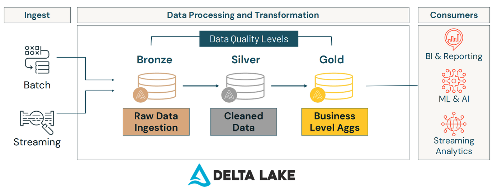
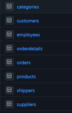
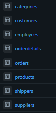
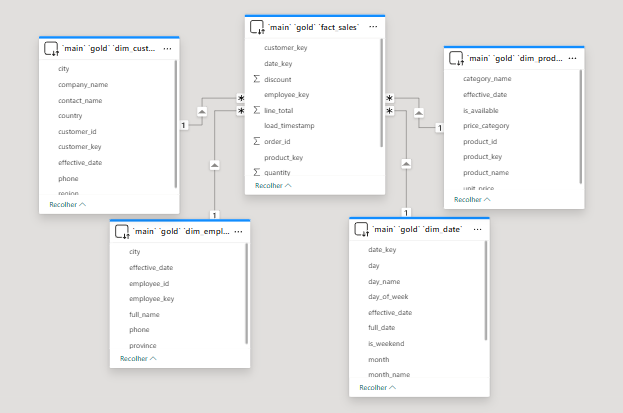
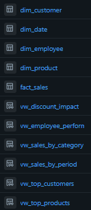
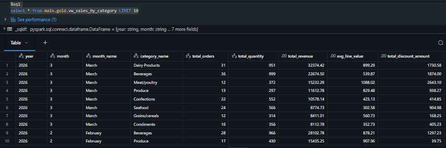
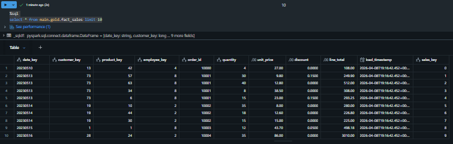
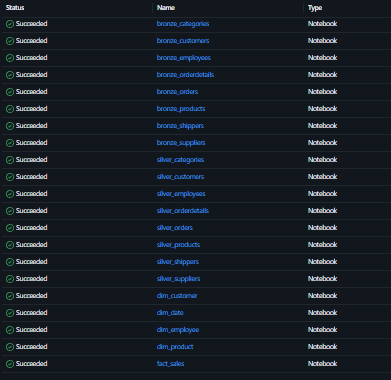

# Arquitetura Medallion aplicada ao Sales Data Lakehouse

## Análise de Vendas, Produtos e Performance com Databricks

---

## 1. Contexto do Projeto

Empresas de distribuição enfrentam desafios crescentes em integrar, consolidar e analisar grandes volumes de dados transacionais — especialmente vendas, produtos e clientes. No caso da SalesFlow Inc., a centralização em SQL Server on-premise causava:
- Baixa escalabilidade
- Dificuldade de integração cruzada entre domínios
- Forte acoplamento entre sistemas operacionais e analíticos
- Rastreabilidade limitada e baixa flexibilidade para análises avançadas

O objetivo estratégico foi **migração para um Lakehouse moderno** utilizando:
- Databricks para processamento escalável
- Delta Lake para garantia de transações ACID
- Unity Catalog para governança centralizada

---

## 2. Justificativa da Arquitetura Medallion

A adoção do padrão **Medallion Architecture** (Bronze → Silver → Gold) resolve as principais dores:
- Rastreabilidade: origem preservada até o consumo analítico
- Reprodutibilidade: toda transformação pode ser refeita
- Isolamento: ingestão, tratamento e consumo são independentes e auditáveis
- Performance: cada camada otimizada para seu caso de uso (raw, curated, analytics)
- Governança: controle via Unity Catalog (acesso, lineage, segurança)

**Diagrama da arquitetura:**


---

## 3. Objetivos do Projeto

### Objetivo Geral
Construir um pipeline de dados moderno, escalável e robusto, voltado para análise de vendas e performance.

### Objetivos Específicos
- Migrar dados transacionais (CSV) para o Lakehouse
- Estruturar pipeline multi-camada (Bronze, Silver, Gold)
- Implementar limpeza profunda e validação de qualidade
- Construir modelo dimensional (Star Schema) otimizado para BI
- Garantir precisão numérica (DECIMAL obrigatório)
- Orquestrar com Jobs automatizados (Databricks Workflows)
- Disponibilizar dados confiáveis para análise em BI e dashboards

---

## 4. Tecnologias Utilizadas

| Tecnologia | Papel na Arquitetura |
|-----------|----------------------|
| Databricks | Execução e orquestração distribuída |
| Spark (PySpark) | Processamento paralelizado |
| Python | Scripts, transformações e funções utilitárias |
| SQL | Views, agregações e consultas |
| Delta Lake | Armazenamento ACID e histórico |
| Unity Catalog | Governança, lineage e segurança |
| Databricks Workflows | Automação e controle de dependências |
| GitHub | Versionamento de notebooks e documentação |
| Power BI | Visualização e análise externa |

---

## 5. Fonte de Dados

Os dados operacionais foram exportados em CSV, totalizando:
- Clientes: 91 registros
- Produtos: 77 registros
- Pedidos: 830 registros
- Itens de pedidos: 2.155 registros
- Funcionários: 9 registros
- Categorias: 8 registros
- Fornecedores: 29 registros
- Transportadoras: 3 registros

**Localização física:** `/Volumes/main/bronze/sales_data/`
**Formato:** CSV, delimitador `;`, encoding UTF-8

---

## 6. Arquitetura de Dados - Medallion

O pipeline segue a arquitetura Medallion, estruturando o fluxo em três camadas sequenciais:

```

┌─────────────┐      ┌─────────────┐      ┌─────────────┐
│  BRONZE     │ -->  │  SILVER     │ -->  │   GOLD      │
│  (Raw Data) │      │  (Curated)  │      │ (Analytics) │
└─────────────┘      └─────────────┘      └─────────────┘
```

Cada camada foi projetada para um objetivo estratégico:
- Bronze: ingestão fiel, rastreabilidade e histórico
- Silver: limpeza, padronização, enriquecimento, validação
- Gold: modelagem dimensional e agregações para BI

---

## 7. Detalhamento Técnico das Camadas

### 7.1 Camada Bronze — Ingestão de Dados
Armazena os dados **exatamente como vieram da origem**, sem alterações de negócio. Permite auditoria e reprocessamento.

- Leitura direta do CSV
- Nenhuma transformação de negócio
- Adição de metadados essenciais: `ingestion_timestamp`, `source_system`, `file_name`
- Persistência em Delta Lake (ACID)
- Camada imutável (garantia de histórico)

**Exemplo de notebook:**
```python
# Bronze: ingestão customers
from pyspark.sql.functions import current_timestamp, lit

df = spark.read.format("csv") \
    .option("header", "true") \
    .option("inferSchema", "true") \
    .option("delimiter", ";") \
    .load("/Volumes/main/bronze/sales_data/customers.csv")

bronze_df = df \
    .withColumn("ingestion_timestamp", current_timestamp()) \
    .withColumn("source_system", lit("SQLServer")) \
    .withColumn("file_name", lit("customers.csv"))

bronze_df.write.format("delta") \
    .mode("overwrite") \
    .saveAsTable("main.bronze.customers")
```


---

### 7.2 Camada Silver — Tratamento e Qualidade

Transformações complexas de limpeza, validação e preparação para uso analítico:
- Limpeza de strings (trim, upper)
- Tratamento de nulos (preenchimento inteligente)
- Remoção de duplicidades
- Conversão rigorosa de tipos (DECIMAL para valores financeiros)
- Validação de regras de negócio específicas
- Criação de colunas derivadas (`is_available`, `price_category`)
- Adição de flag de qualidade (`VALID` ou `INVALID`)

**Exemplo de notebook:**
```python
from pyspark.sql.types import DecimalType
from pyspark.sql.functions import col, when, trim, upper

df = spark.table("main.bronze.products")

silver_df = df \
    .dropDuplicates(["ProductID"]) \
    .withColumn("ProductName", trim(upper(col("ProductName")))) \
    .fillna({"UnitsInStock": 0}) \
    .withColumn("is_available", when(col("UnitsInStock") > 0, True).otherwise(False)) \
    .withColumn("UnitPrice", col("UnitPrice").cast(DecimalType(10,2))) \
    .withColumn("data_quality_status", when(..., "INVALID").otherwise("VALID"))

silver_df.write.format("delta").mode("overwrite").saveAsTable("main.silver.products")
```


---

### 7.3 Camada Gold — Modelo Dimensional

Dados prontos para análise, estruturados em **Star Schema**:
- 1 Tabela Fato: `fact_sales` (granularidade: item de venda)
- 4 Dimensões: `dim_customer`, `dim_product`, `dim_employee`, `dim_date`
- Uso de surrogate keys (integração e rastreabilidade)
- 6 Views analíticas para agregações estratégicas

**Star Schema — Power BI:**


**Objetos Gold:**


**Views agregadas:**

- `vw_sales_by_category`, `vw_employee_performance`, `vw_top_customers`, `vw_sales_by_period`, `vw_discount_impact`, `vw_top_products`

---

## 8. Validação e Precisão Numérica

**Precisão financeira:**
- Conversão obrigatória de valores monetários para DECIMAL (ex: `DecimalType(10,2)`)
- Evita erros críticos (arredondamento) comuns com tipo DOUBLE

Amostra da tabela fato:


- unit_price: 18.00 (preciso)
- discount: 0.0500
- line_total: 342.00

**Validação rigorosa:**
- Métricas auditadas
- Consistência em agregações (view de validação)

---

## 9. Orquestração e Workflow Automatizado

Pipeline end-to-end com 21 tarefas agrupadas em 4 fases principais:
- Bronze (8 tasks paralelas)
- Silver (8 tasks paralelas)
- Gold Dimensions (4 tasks)
- Gold Fact & Views (sequencial)

**Métricas de execução:**
- Tempo médio: 5–10 minutos
- Retry automático (resiliência)
- Execução paralela e dependências controladas

**DAG visual:**


---

## 10. Organização e Estrutura do Projeto

Organização de pastas para facilitar navegação e versionamento:


```
00_Setup/          # Configuração inicial
01_Bronze/         # 8 notebooks de ingestão
02_Silver/         # 8 notebooks de limpeza
03_Gold/           # 6 notebooks de modelagem
04_Utils/          # Funções reutilizáveis
05_Jobs/           # Documentação do Job
06_Documentation/  # README e dicionário de dados
07_Validação/      # Testes de qualidade
imgs/              # Prints ilustrativos
```

**Total:** 21 notebooks + 3 documentos + 8 imagens

---

## 11. Resultados Alcançados e Métricas

- Pipeline completo implementado e validado
- 8 tabelas Bronze com rastreabilidade
- 8 tabelas Silver com qualidade (99,7% válidos)
- 4 dimensões + 1 fato + 6 views Gold
- Precisão numérica 100% correta (DECIMAL)
- Integridade referencial auditada (>99,8% íntegra)
- Pipeline automatizado (21 tasks; média 7 min)
- Governança consolidada via Unity Catalog
- Star Schema visualizado no Power BI

---

## 12. Aprendizados e Boas Práticas

- Medallion Architecture: facilita manutenção e troubleshooting
- Delta Lake: garante consistência, versionamento e time travel
- Unity Catalog: centraliza governança e linhagem
- PySpark + SQL: combinam flexibilidade ETL e performance analítica
- DECIMAL: obrigatório para valores financeiros
- Star Schema: otimiza BI e relatórios
- Workflows: escalabilidade e resiliência operacional
- Flags de qualidade: rastreabilidade de registros inválidos

---

## 13. Próximos Passos

- Implementação de SCD Type 2 em dimensões
- Testes automatizados de qualidade
- Integração direta e refresh com Power BI
- Políticas de segurança avançadas (Row-Level Security)
- Alertas, monitoramento e dashboard de SLA

---

## 14. Referências e Materiais Complementares

- [Databricks Medallion Architecture](https://www.databricks.com/glossary/medallion-architecture)
- [Delta Lake Documentation](https://docs.delta.io/)
- [Unity Catalog Guide](https://docs.databricks.com/data-governance/unity-catalog/index.html)
- [PySpark SQL Functions](https://spark.apache.org/docs/latest/api/python/reference/pyspark.sql/functions.html)
- [Star Schema Design](https://en.wikipedia.org/wiki/Star_schema)
- [Databricks Workflows](https://docs.databricks.com/workflows/index.html)

---

## 15. Conclusão

Este projeto demonstra a construção de uma arquitetura Lakehouse moderna, aplicando Medallion Architecture com camadas progressivas, integrando governança, precisão técnica, automação e visualização analítica. A combinação destas práticas garante uma base confiável, escalável e auditável para decisões de negócio.

**Status:** Pipeline production-ready, pronto para BI, analytics e expansão futura.
